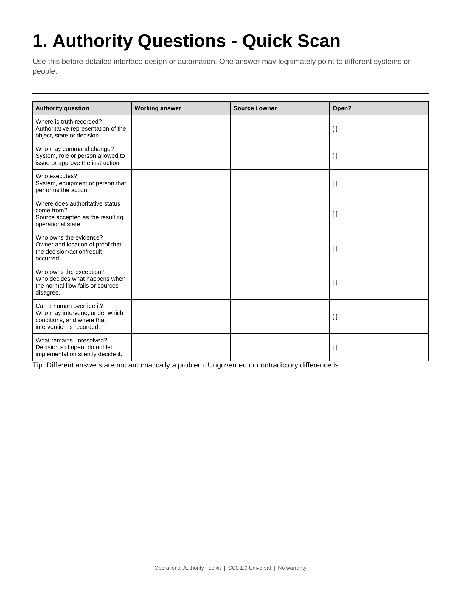
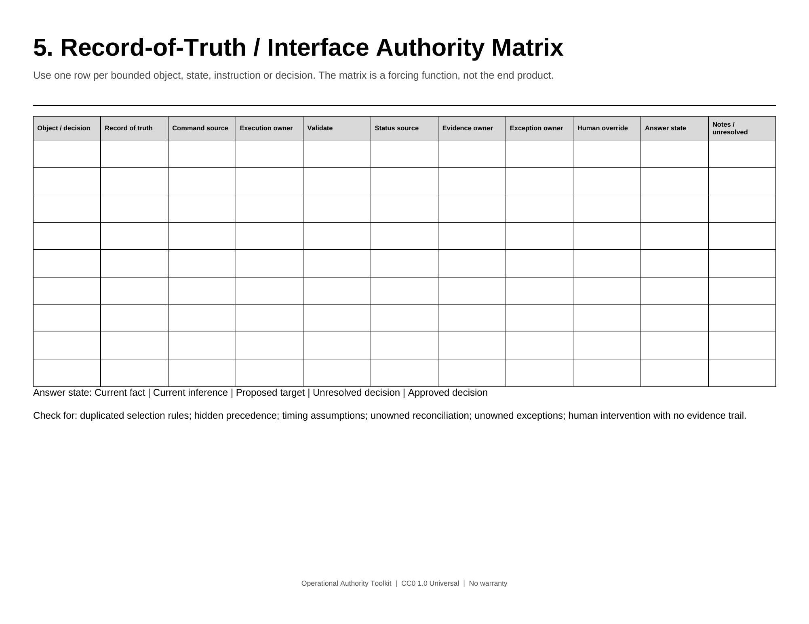
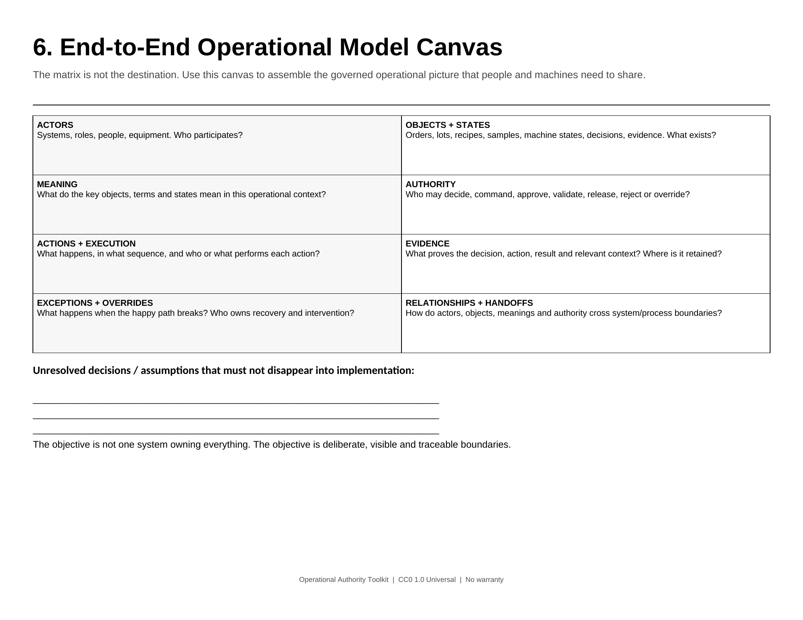

# Operational Authority Toolkit

Open, unbranded field templates for making operational meaning, authority, evidence, and exceptions explicit before detailed automation.

This toolkit is a practical companion to the article **Operational Truth in the Age of AI**. It is not an industry standard, an ATS methodology, or a certification scheme.

## What is in the pack

- **Authority Questions - Quick Scan** - expose unresolved ownership and authority questions early.
- **Six-Verbs Authority Worksheet** - Define, Authorize, Execute, Validate, Evidence, Override.
- **State of the Answer** - distinguish current fact, current inference, proposed target, unresolved decision, and approved decision.
- **Interface Authority Decision Record** - capture one bounded interface or operational decision with its authority and evidence boundaries.
- **Record-of-Truth / Interface Authority Matrix** - working matrix for truth, command, execution, validation, status, evidence, exceptions, and override.
- **End-to-End Operational Model Canvas** - step beyond the worksheet toward the actual target: a coherent operational model.
- **Pre-Automation Authority Check** - a short gate before more operational action is delegated.

## Downloads

These links download the files directly rather than opening GitHub's binary preview layer.

| Need | Download |
| --- | --- |
| Print / workshop | [PDF](https://raw.githubusercontent.com/Apathyte/operational-authority-toolkit/main/print/Operational_Authority_Toolkit_CC0.pdf) |
| Edit the full pack | [DOCX](https://raw.githubusercontent.com/Apathyte/operational-authority-toolkit/main/editable/Operational_Authority_Toolkit_CC0.docx) |
| Work directly in a matrix | [XLSX](https://raw.githubusercontent.com/Apathyte/operational-authority-toolkit/main/workbook/Record_of_Truth_Interface_Authority_Matrix_CC0.xlsx) |
| Take everything | [ZIP](https://raw.githubusercontent.com/Apathyte/operational-authority-toolkit/main/bundle/Operational_Authority_Toolkit_CC0.zip) |

## Use it like a working tool

Choose the page that helps. Change the language. Remove fields. Add domain controls. Replace the matrix entirely if your existing architecture or decision-record practice captures the same information better.

The objective is not to complete a framework. The objective is to leave enough of the operational model explicit that systems, current teams, and the people who inherit the work later do not have to reconstruct authority from code, interfaces, or memory.

The matrix is therefore not the end product. The end goal is a coherent end-to-end operational model in which the relevant actors, objects, states, relationships, meanings, authorities, actions, evidence, and exceptions are explicit enough to be understood consistently.

## Preview

### Authority quick scan

### Record-of-Truth / Interface Authority Matrix

### End-to-End Operational Model Canvas

## License

Released under **CC0 1.0 Universal**. No attribution is required. Copy it, adapt it, redistribute it, put your own branding on it, or build something better.

Canonical CC0 legal code: https://creativecommons.org/publicdomain/zero/1.0/legalcode

## Integrity

`SHA256SUMS.txt` contains SHA-256 hashes for the distributed artifacts.
